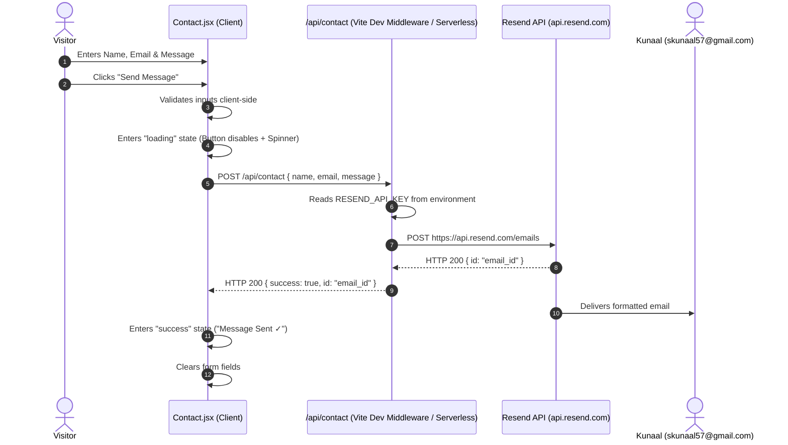

# Kunaal — Software Engineering & AI/ML Portfolio

A modern, responsive, and data-driven developer portfolio built with **React 18**, **Vite**, and **Tailwind CSS**. Designed with an engineering aesthetic featuring a dynamic neural network background canvas, interactive simulated terminal, modular data layer, direct resume download, and server-side email dispatch powered by **Resend**.

---

## Table of Contents

1. [Project Overview](#project-overview)
2. [Portfolio Purpose](#portfolio-purpose)
3. [Key Features](#key-features)
4. [Complete Technology Stack](#complete-technology-stack)
5. [Project Structure](#project-structure)
6. [Explanation of Important Folders & Files](#explanation-of-important-folders--files)
7. [Getting Started](#getting-started)
   - [Prerequisites](#prerequisites)
   - [Installation](#installation)
   - [Running Locally](#running-locally)
   - [Building for Production](#building-for-production)
8. [Environment Variables Configuration](#environment-variables-configuration)
9. [Contact Form & Resend Email Integration](#contact-form--resend-email-integration)
10. [Resume Download Setup](#resume-download-setup)
11. [Coding & Professional Profiles Configuration](#coding--professional-profiles-configuration)
12. [Data Layer & Content Management](#data-layer--content-management)
    - [How Data is Managed](#how-data-is-managed)
    - [How to Update Personal Information](#how-to-update-personal-information)
    - [How to Update Profile Links](#how-to-update-profile-links)
    - [How to Add a New Project](#how-to-add-a-new-project)
    - [How to Edit Skills](#how-to-edit-skills)
    - [How to Edit Education, Certifications & Achievements](#how-to-edit-education-certifications--achievements)
13. [Deployment Guide](#deployment-guide)
    - [Deploying to Vercel (Recommended)](#deploying-to-vercel-recommended)
    - [Deploying to Netlify](#deploying-to-netlify)
14. [Important Configuration Notes](#important-configuration-notes)
15. [Troubleshooting & Common Issues](#troubleshooting--common-issues)

---

## Project Overview

This repository houses the personal software engineering and artificial intelligence portfolio for **Kunaal**. The application is structured as a Single Page Application (SPA) that emphasizes clean architecture, quantified accomplishments, and smooth user interactions.

All personal narrative, projects, educational milestones, and skills are decoupled into dedicated data files under `src/data/`, allowing seamless updates without modifying layout or presentation components.

---

## Portfolio Purpose

- **Demonstrate Technical Specialization**: Highlight a dedicated focus on Computer Science, Artificial Intelligence, Machine Learning, Deep Learning, Natural Language Processing, and Backend Architecture.
- **Showcase Quantified Outcomes**: Present real-world metrics, such as 500+ Data Structures & Algorithms problems solved, a 7.95/10 CGPA, and specific system performance improvements.
- **Provide Direct Recruiter Access**: Offer frictionless communication channels via a direct resume download and an integrated contact form that dispatches messages to `skunaal57@gmail.com`.
- **Exhibit Frontend Engineering Standards**: Deliver a responsive, accessible, dark-themed user interface utilizing modern CSS glassmorphism, responsive canvas animations, and micro-interactions.

---

## Key Features

- **Interactive Neural Particle Background**: An HTML5 `<canvas>` background simulation rendering network nodes with real-time mouse repulsion, distance-based synaptic links, and full `prefers-reduced-motion` compliance.
- **Simulated Developer Terminal**: An interactive terminal component with switchable tabs (`identity.sh`, `edu.env`, `stack.sys`), blinking cursor, and one-click clipboard copy.
- **One-Click Resume Download**: Direct browser download of `Kunaal_Resume.pdf` (native binary download attribute, avoiding third-party tab popups).
- **Comprehensive Project Showcase**: Detailed project cards displaying badges, timelines, summary descriptions, technology pills, quantifiable metric strips, engineering highlights, and an animated ellipsis teaser (*"coming soon..."*).
- **Verified Skills Matrix**: Six categories (Languages, AI/ML, Databases, Web, Tools, Soft Skills) with dynamic category filtering and proficiency badges.
- **Academic Timeline & Credentials**: Alternating chronological timeline for formal education and dedicated credential cards for certifications (e.g., NVIDIA Fundamentals of Deep Learning).
- **Leadership & Activities**: Spotlights collaborative deliverables, team coordination across 4-member groups, and algorithmic problem-solving milestones.
- **Secure Serverless Contact Form**:
  - Full client-side input validation and error feedback.
  - Multi-state animated submission button (Idle &rarr; Loading Spinner &rarr; *"Message Sent ✓"* &rarr; Error Recovery).
  - Prevention of duplicate or rapid-fire submissions.
  - Server-side email delivery via the **Resend API** with zero client-side secret exposure.
- **Clickable Profile Cards**: Dedicated cards and footer links connecting to verified profiles on GitHub, LinkedIn, LeetCode, and Codolio with custom SVG brand icons.
- **Custom Favicon Suite**: Cross-browser, multi-resolution favicons and Apple Touch icons configured via `site.webmanifest`.

---

## Complete Technology Stack

| Category | Technology | Version | Purpose |
| :--- | :--- | :--- | :--- |
| **Core Framework** | React | `^18.3.1` | Component-based user interface |
| **DOM Renderer** | React DOM | `^18.3.1` | Web DOM mounting & lifecycle |
| **Build Tool & Server** | Vite | `^6.0.7` | Lightning-fast HMR and optimized production bundling |
| **Styling Engine** | Tailwind CSS | `^3.4.17` | Utility-first styling with custom color tokens |
| **CSS Preprocessor** | PostCSS / Autoprefixer | `^8.4.49` / `^10.4.20` | Cross-browser CSS transformation & prefixing |
| **Iconography** | Lucide React | `^1.16.0` | Clean, modern feather-style iconography |
| **Email Service** | Resend SDK / REST API | `^6.26.0` | Transactional email delivery |
| **Backend Integration** | Serverless / Vite Middleware | Node.js | Secure handling of `/api/contact` |
| **Typography** | Google Fonts | CDN | `Inter`, `Outfit`, and `JetBrains Mono` |

---

## Project Structure

```text
Portfolio/
├── .env.example              # Sample environment variables template
├── .env.local                # Local environment variables (Git-ignored)
├── .gitignore                # Git ignore patterns (node_modules, dist, envs)
├── index.html                # Main HTML entry point with meta tags and font links
├── package.json              # Project metadata, scripts, and dependencies
├── package-lock.json         # Pinned dependency tree
├── postcss.config.js         # PostCSS configuration for Tailwind CSS
├── tailwind.config.js        # Tailwind theme customizations (colors, fonts, animations)
├── vite.config.js            # Vite build configuration + local /api/contact dev middleware
├── api/
│   └── contact.js            # Serverless function for Resend email dispatch (Vercel/production)
├── public/
│   ├── Kunaal_Resume.pdf     # Resume PDF downloaded by the "Download Resume" button
│   ├── favicon.ico           # Multi-resolution favicon icon
│   ├── favicon-16x16.png     # 16x16 PNG favicon
│   ├── favicon-32x32.png     # 32x32 PNG favicon
│   ├── apple-touch-icon.png  # 180x180 Apple touch icon
│   ├── android-chrome-192x192.png # 192x192 Android Chrome icon
│   ├── android-chrome-512x512.png # 512x512 Android Chrome icon
│   └── site.webmanifest      # Progressive web app manifest for browser icons
└── src/
    ├── main.jsx              # React DOM root render entry point
    ├── App.jsx               # Main layout orchestrating all sections
    ├── index.css             # Tailwind base layers, glassmorphism classes, animations
    ├── components/
    │   ├── About.jsx             # About section: academic focus & technical disciplines
    │   ├── Achievements.jsx      # Key achievements & milestone metrics
    │   ├── Activities.jsx        # Leadership & 500+ DSA problem milestone showcase
    │   ├── BackgroundCanvas.jsx  # Interactive HTML5 particle/neural background
    │   ├── BrandIcons.jsx        # Custom SVG brand icons (GitHub, LinkedIn, LeetCode, Codolio)
    │   ├── Certifications.jsx    # Professional training & NVIDIA certification cards
    │   ├── Contact.jsx           # Contact form & social profile links
    │   ├── Education.jsx         # Chronological education timeline
    │   ├── Footer.jsx            # Footer with brand, quick links, and scroll-to-top
    │   ├── Hero.jsx              # Hero banner with headline, CTAs, metrics & terminal
    │   ├── Navbar.jsx            # Sticky glassmorphic navbar with active scroll spy
    │   ├── ProjectCard.jsx       # Reusable project card component
    │   ├── Projects.jsx          # Projects grid & modular callout note
    │   ├── Skills.jsx            # Filterable technical & soft skills matrix
    │   └── Terminal.jsx          # Interactive simulated code terminal
    └── data/
        ├── achievements.js   # Quantified achievement records
        ├── activities.js     # Activities, leadership roles, and algorithmic stats
        ├── certifications.js # Verified certifications and credentials
        ├── education.js      # Educational degrees, boards, and CGPA scores
        ├── personal.js       # Personal identity, bio, contact info, and profile URLs
        ├── projects.js       # Detailed project specifications and metrics
        └── skills.js         # Categorized skills list and proficiency levels
```

---

## Explanation of Important Folders & Files

- **`api/contact.js`**: Standard Serverless Function entry point. When deployed to Vercel (or adapted to Netlify functions), requests made to `/api/contact` execute this handler server-side, reading `process.env.RESEND_API_KEY` to send emails safely without leaking secrets to visitors.
- **`vite.config.js`**: Configures Vite with the React plugin and implements a local development middleware (`contactDevApiPlugin`). This enables `/api/contact` to function seamlessly during local development (`npm run dev`) by reading keys from `.env.local` without needing an external backend server running.
- **`public/`**: Static assets served directly at the root URL. Files here, including `Kunaal_Resume.pdf` and all favicon images, are copied verbatim to the build output.
- **`src/data/`**: The decoupled data layer. Whenever you need to add a project, edit a skill, or update a score, edit the corresponding file in this folder; no JSX component markup needs to be touched.
- **`src/components/BackgroundCanvas.jsx`**: Manages the dynamic HTML5 background canvas. Generates particles connected by synaptic links based on proximity and handles mouse tracking. Automatically disables animations when `prefers-reduced-motion` is active.
- **`src/index.css`**: Defines custom scrollbars, cyber grid patterns, glassmorphic card classes (`.glass-card`, `.glass-nav`), form validation styles, and custom keyframes for the sequential animated ellipsis.

---

## Getting Started

### Prerequisites

- **Node.js**: Version `18.0.0` or higher (tested on Node `v20.x` and `v22.x`).
- **npm**: Version `9.x` or higher (bundled with Node.js).

### Installation

1. Clone the repository to your local machine:
   ```bash
   git clone https://github.com/Kunaal9034/Kunaal-Portfolio.git
   cd Kunaal-Portfolio
   ```

2. Install the project dependencies:
   ```bash
   npm install
   ```

### Running Locally

Start the Vite local development server:
```bash
npm run dev
```

Open your browser and navigate to:
```text
http://localhost:3000
```

> **Note**: The dev server is configured to run on port `3000` by default in `vite.config.js`.

### Building for Production

To create an optimized, minified production build:
```bash
npm run build
```

The compiled assets will be generated in the `dist/` directory:
- `dist/index.html`: Optimized HTML entry point.
- `dist/assets/*.js`: Bundled JavaScript chunks (tree-shaken and gzipped).
- `dist/assets/*.css`: Purged and minified Tailwind CSS.

To preview the production build locally:
```bash
npm run preview
```

---

## Environment Variables Configuration

The project uses environment variables exclusively for the contact form email service.

### Configuration Files

1. Copy the provided `.env.example` template to `.env.local`:
   ```bash
   cp .env.example .env.local
   ```
   *(On Windows PowerShell: `Copy-Item .env.example .env.local`)*

2. Open `.env.local` and configure your credentials:
   ```env
   # Resend API Key (Get your free key at https://resend.com/api-keys)
   RESEND_API_KEY=re_your_api_key_here

   # Destination Email (Where you want to receive portfolio messages)
   RESEND_TO_EMAIL=skunaal57@gmail.com

   # Sender Address (Default Resend testing address or your verified domain)
   RESEND_FROM_EMAIL=Portfolio Contact <onboarding@resend.dev>
   ```

### Variable Details

| Variable | Required | Default Value | Description |
| :--- | :--- | :--- | :--- |
| `RESEND_API_KEY` | **Yes** | *None* | Secret API key starting with `re_` obtained from [Resend](https://resend.com). |
| `RESEND_TO_EMAIL` | Optional | `skunaal57@gmail.com` | The destination inbox where contact inquiries will be delivered. |
| `RESEND_FROM_EMAIL` | Optional | `Portfolio Contact <onboarding@resend.dev>` | The "From" header. Use `onboarding@resend.dev` for Resend's free tier, or your custom domain once verified. |

> **Security Reminder**: `.env.local` is listed in `.gitignore` and must **never** be committed to version control.

---

## Contact Form & Resend Email Integration

The contact form enables visitors to reach out directly through the website without opening their personal desktop email client.

### Architecture



### Received Email Format

When an email arrives in `skunaal57@gmail.com`, it includes:
- **Subject**: `New Portfolio Contact — [User Name]`
- **Sender**: `Portfolio Contact <onboarding@resend.dev>` (or your verified domain)
- **Reply-To**: Set directly to the sender's email address, enabling you to click "Reply" in Gmail to respond immediately.
- **Body**: Both formatted HTML and plain-text fallback displaying the sender's Name, Email address, and Message.

### Button States & Animations

The `Send Message` button in `src/components/Contact.jsx` supports four interactive states:
1. **Idle**: Displays the paper plane icon and `"Send Message"`.
2. **Loading**: Disables inputs, animates a spinning loader (`Loader2`), and prevents double-submissions.
3. **Success**: Displays a green checkmark (`CheckCircle2`), text `"Message Sent ✓"`, and automatically resets after 5 seconds.
4. **Error**: Displays an alert icon with a `"Try Again"` prompt and a descriptive error banner.

---

## Resume Download Setup

The resume download is managed natively through static hosting in `public/`:

1. The resume file is stored at:
   ```text
   public/Kunaal_Resume.pdf
   ```
2. The `Hero.jsx` component implements the native download button:
   ```jsx
   <a
     href="/Kunaal_Resume.pdf"
     download="Kunaal_Resume.pdf"
     title="Download Kunaal's Resume"
   >
     <FileText className="w-4 h-4 text-slate-400" />
     <span>Download Resume</span>
   </a>
   ```
3. When clicked on any desktop or mobile browser, the browser directly downloads the file as `Kunaal_Resume.pdf` without navigating away or opening blank tabs.

### Updating Your Resume

To replace the resume with an updated version:
1. Compile or export your new resume as a PDF.
2. Replace the file at `public/Kunaal_Resume.pdf` (keeping the exact filename).
3. The new PDF will immediately take effect in local development and upon your next deployment.

---

## Coding & Professional Profiles Configuration

All professional links are defined in `src/data/personal.js` inside the `socials` array:

```javascript
socials: [
  {
    name: "GitHub",
    url: "https://github.com/Kunaal9034",
    icon: "Github"
  },
  {
    name: "LinkedIn",
    url: "https://www.linkedin.com/in/kunaal90/",
    icon: "Linkedin"
  },
  {
    name: "LeetCode",
    url: "https://leetcode.com/u/Kunaal001/",
    icon: "Code2"
  },
  {
    name: "Codolio",
    url: "https://codolio.com/profile/Kunaal",
    icon: "Terminal"
  }
]
```

These entries automatically power:
- The full-width, clickable interactive profile cards in the **Contact** section (`src/components/Contact.jsx`).
- The quick social icon buttons in the **Footer** (`src/components/Footer.jsx`).

All links include `target="_blank"` and `rel="noopener noreferrer"` for secure external tab navigation.

---

## Data Layer & Content Management

The entire portfolio is engineered with a clean separation between data and presentation. To update any information, edit the corresponding file in `src/data/`.

### How to Update Personal Information

Edit `src/data/personal.js`:
- **Name & Title**: Update `name`, `title`, and `tagline`.
- **Contact Details**: Update `contact.email`, `contact.phone`, and `contact.location`.
- **Highlights Ribbon**: Modify the metrics displayed in the Hero banner (e.g., `"500+"`, `"7.95/10"`).

### How to Update Profile Links

To change an existing profile URL or username, update the `url` property of the corresponding item in `src/data/personal.js`.

### How to Add a New Project

Open `src/data/projects.js` and add a new object to the `projectsData` array:

```javascript
{
  id: "your-project-slug",
  title: "Your Project Title",
  category: "Backend & Systems", // or "AI / Machine Learning", "Web App"
  period: "Apr 2026 – May 2026",
  badge: "Machine Learning",
  summary: "A concise 1-2 sentence description explaining the purpose and architectural solution.",
  techStack: ["Python", "PyTorch", "FastAPI", "Docker"],
  highlights: [
    "Trained custom convolutional network achieving 94.2% validation accuracy on test benchmark.",
    "Engineered low-latency REST inference pipeline serving predictions under 45ms.",
    "Integrated automated batch preprocessing pipeline reducing ingestion time by 50%."
  ],
  stats: [
    { label: "Accuracy", value: "94.2%" },
    { label: "Latency", value: "<45ms" },
    { label: "Throughput", value: "250 req/s" },
    { label: "Test Samples", value: "10k+" }
  ],
  links: {
    github: "https://github.com/Kunaal9034/your-repo", // Optional: leave "" if private
    demo: "https://your-demo-url.com"                 // Optional: leave "" if not hosted
  }
}
```

The project will automatically render with all badges, metric strips, and action buttons.

### How to Edit Skills

Open `src/data/skills.js`. You can add new skills to existing categories or adjust proficiency levels:

```javascript
{ name: "FastAPI", level: "Proficient", desc: "Asynchronous backend APIs and microservices" }
```

### How to Edit Education, Certifications & Achievements

- **Education**: Edit `src/data/education.js` to modify degrees, CGPA/marks, and institution details.
- **Certifications**: Edit `src/data/certifications.js` to add credentials, issuing organizations, or training dates.
- **Achievements & Activities**: Edit `src/data/achievements.js` and `src/data/activities.js` to update milestones, group project leadership counts, and problem-solving statistics.

---

## Deployment Guide

### Deploying to Vercel (Recommended)

Vercel provides native, zero-configuration support for Vite single-page applications and the `/api` serverless folder:

1. Push your repository to GitHub.
2. Sign in to [Vercel](https://vercel.com) and click **Add New &rarr; Project**.
3. Import your `portfolio` repository.
4. Framework preset will automatically detect **Vite**.
5. In the **Environment Variables** section, add:
   - `RESEND_API_KEY`: Your live Resend API key (`re_...`).
   - `RESEND_TO_EMAIL`: `skunaal57@gmail.com`
   - `RESEND_FROM_EMAIL`: `Portfolio Contact <onboarding@resend.dev>` (or your verified domain).
6. Click **Deploy**.
7. Vercel automatically builds the project (`npm run build`) and maps `api/contact.js` to `/api/contact`.

### Deploying to Netlify

1. Push your repository to GitHub.
2. In [Netlify](https://netlify.com), click **Add new site &rarr; Import an existing project**.
3. Build command: `npm run build`
4. Publish directory: `dist`
5. Configure your environment variables under **Site configuration &rarr; Environment variables**.
6. If using Netlify Serverless Functions, place `api/contact.js` inside `netlify/functions/contact.js` or configure a redirect in `netlify.toml`.

---

## Important Configuration Notes

- **Vite Port**: The local development server is pinned to port `3000` via `vite.config.js` (`server: { port: 3000 }`).
- **Resend Free Tier Restrictions**: When using Resend's sandbox sender address (`onboarding@resend.dev`), Resend policy allows delivering emails **only** to the primary email address registered on your Resend account (`skunaal57@gmail.com`). To deliver to arbitrary email addresses, you must add and verify a custom domain in your Resend dashboard.
- **Reduced Motion Support**: `BackgroundCanvas.jsx` listens to `window.matchMedia('(prefers-reduced-motion: reduce)')`. Users who have disabled system animations will experience a static dark grid instead of moving particles to maintain comfort and accessibility.
- **Asset Links**: All assets in `public/` are referenced with absolute root paths (e.g., `/Kunaal_Resume.pdf`, `/favicon-32x32.png`), ensuring links resolve correctly regardless of routing depth.

---

## Troubleshooting & Common Issues

### 1. Contact Form Returns "RESEND_API_KEY is not configured"
- **Cause**: The `.env.local` file is missing or does not define `RESEND_API_KEY`.
- **Solution**: Create `.env.local` in the project root containing `RESEND_API_KEY=re_your_key`. In local development, the custom Vite dev middleware reloads environment variables automatically on each request without requiring a server restart. On Vercel, ensure the variable is added in your project settings.

### 2. Contact Form Returns "Failed to send email via Resend" (403 Forbidden)
- **Cause**: You may be attempting to send from a custom email address without verifying the domain on Resend, or using an expired API key.
- **Solution**: Set `RESEND_FROM_EMAIL` to `Portfolio Contact <onboarding@resend.dev>` in your environment variables, and make sure `RESEND_TO_EMAIL` is the email registered to your Resend account.

### 3. Port 3000 is Already in Use
- **Cause**: Another process is occupying port 3000.
- **Solution**: Either terminate the existing process or update the port in `vite.config.js`:
  ```javascript
  server: {
    port: 3001,
    open: false
  }
  ```

### 4. Resume Download Opens in a New Tab Instead of Downloading
- **Cause**: The browser is ignoring the `download` attribute because of a cross-origin discrepancy.
- **Solution**: Keep `Kunaal_Resume.pdf` hosted inside the local `public/` folder so it shares the same origin as the frontend application.

### 5. Build Fails with "Rollup failed to resolve import"
- **Cause**: A component or data file was deleted or renamed without updating its import statement.
- **Solution**: Run `npm run build` in your terminal to inspect the specific file and line number causing the import failure. Ensure all filenames match casing exactly (e.g., `Hero.jsx`, not `hero.jsx`).

---

## Maintenance & License

- **Author**: Kunaal
- **Repository**: [https://github.com/Kunaal9034/Kunaal-Portfolio](https://github.com/Kunaal9034/Kunaal-Portfolio)
- **License**: Private / Personal Portfolio
